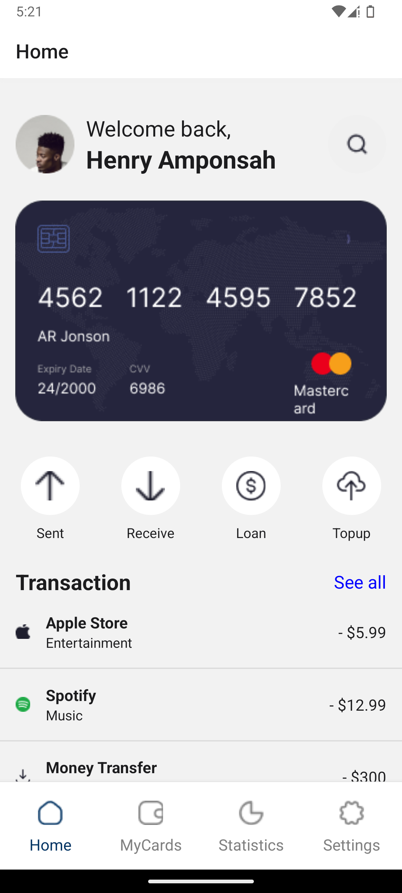
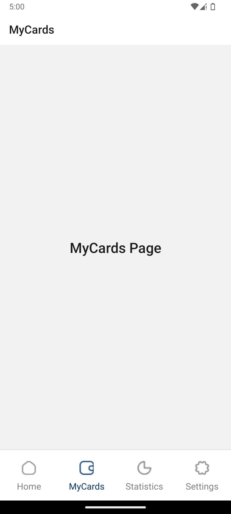
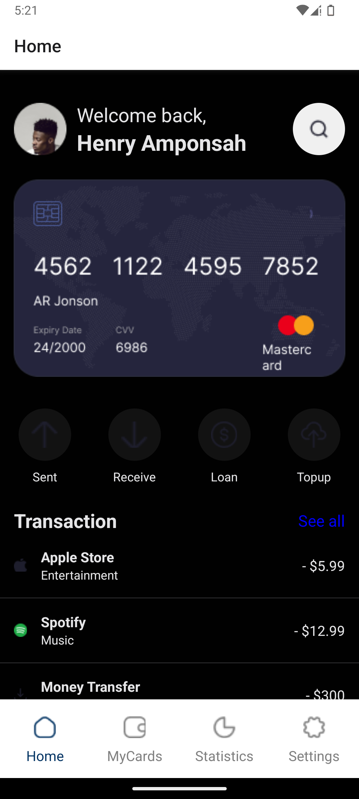

# REACT NATIVE APPLICATION

#### Student Name: Henry Amponsah

#### Student ID : 11358466

## Creation Of App

The **Home** screen was created first. With this, various custom components were created, such as the header,  
features, transaction list and others. The **Settings** screen was created thereafter, including the navigation, then followed  
**MyCards** and **Statistics** screens. All these were done in the **normal theme _(light mode)_**. Then lastly, the **dark theme**  
feature when the theme button is toggled was implemented into the application.

## Application In The Light Mode [Running on Google Pixel 7a]

### Home Screen

### MyCards Screen

### Statistics Screen

### Settings Screen

## Application In The Dark Mode [Running on Google Pixel 7a]

### Home Screen

### MyCards Screen

### Statistics Screen

### Settings Screen

## Briefing:

This is an app created using 'react-native' and 'expo-go' frameworks.
